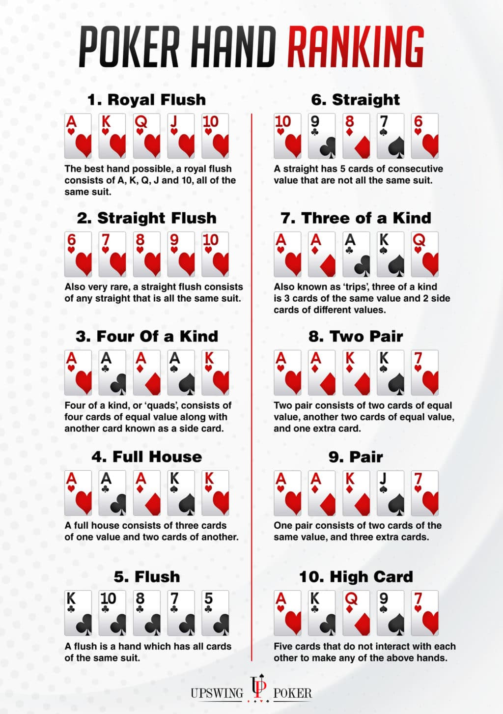

# PokerBot
Poker bot

Implementation of counter factual regret minimization with public chance sampling [[1]](#1) on the game of texas holdem. Several abstractions were
used to reduce the number of game states [[2]](#2)

## References
<a id="1">[1]</a> 
DJohanson, Michael, et al. "Efficient Nash equilibrium approximation through Monte Carlo counterfactual regret minimization." Aamas. 2012.
<a id="2">[2]</a> 
Zinkevich, Martin, et al. "Regret minimization in games with incomplete information." Advances in neural information processing systems 20 (2007).

